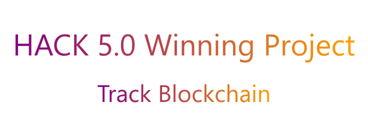

# Corruption-Free Tenders: A Transparent Tender Bidding System

> **Tagline:** _Powering a corruption-free and transparent government procurement system using blockchain._

- [Devfolio Link](https://devfolio.co/projects/tenderlink-51ab)

## Overview

India’s public procurement process, especially in infrastructure and logistics, often suffers from corruption, lack of transparency, and bid manipulation. Our project leverages **blockchain technology** to build a transparent, tamper-proof, and auditable system for managing government tenders.

Through a decentralized tendering and bidding mechanism, we ensure **fairness**, **traceability**, and **efficiency** while minimizing fraudulent practices. The system brings together government officials, contractors, suppliers, and auditors into a transparent ecosystem where data integrity and accountability are paramount.

---

## Problem Statement

Public procurement in India—especially for infrastructure projects—has long been plagued with **corruption**, **bid rigging**, **fake documentation**, and **lack of real-time transparency**. Contractors often exploit loopholes in the manual tendering process, submitting fake invoices, using substandard materials, and winning tenders through favoritism rather than fair competition.

Our project addresses this by offering a **decentralized and auditable tender system** using blockchain. From **tender launch**, **bid submission**, **material purchase tracking**, to **audits**, everything is stored immutably, ensuring **public visibility** and **unmatched trust** in every stage of the procurement lifecycle.

---

## How It Works

### Roles

- **Government Admin**: Launches tenders, verifies bids, and monitors procurement.
- **Contractor**: Bids for tenders and procures goods from registered suppliers.
- **Supplier**: Provides proof of legitimate material purchases to the blockchain.
- **Transporter**: Manages shipment information tied to a tender.
- **Auditor (NGO/3rd Party)**: Audits on-chain proof for compliance and red flags.

### Tech Stack

- **Frontend**: React.js with Aceternity UI components for rapid prototyping.
- **Backend**: Node.js & Express for API routing and Web3 integration.
- **Blockchain**: Ethereum + Solidity Smart Contracts.
- **Dev Tools**: Hardhat, Ethers/Web3.js, Ganache for local testing.
- **Deployment**: GitHub Actions, dotenv, and Hardhat deployment scripts.

---

## What’s Stored on Blockchain?

- Tender creation metadata (tender ID, purpose, value, dates).
- Contractor bid hash and submission timestamp.
- Approved bid hash (when selected).
- Supplier material hashes or receipts.
- Auditor flags or comments.

We **emit events** and store **minimal hashes** to keep the blockchain usage lightweight while storing detailed tender data in our off-chain backend.

---
